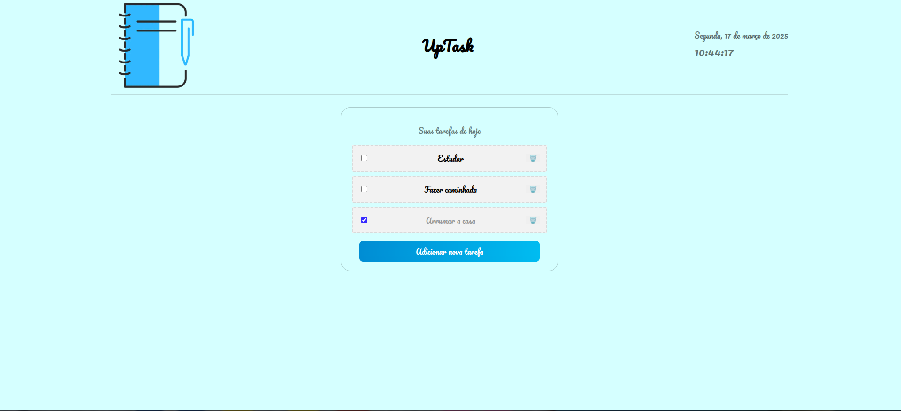
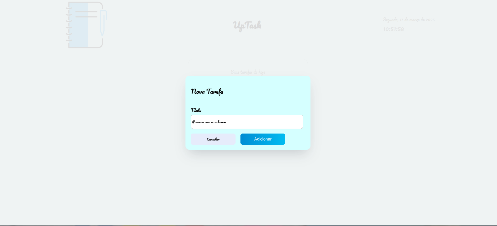
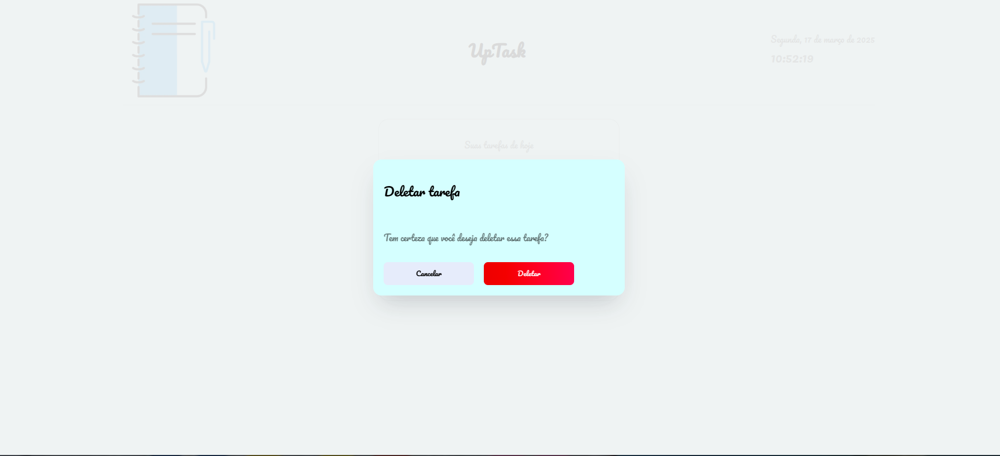

# To-Do List Application

Este é um projeto de uma lista de tarefas simples, construído com **Next.js**, utilizando **SCSS** para estilização e **LocalStorage** para persistência de dados.

## Funcionalidades

- **Adicionar tarefas**: Permite ao usuário adicionar novas tarefas à lista.
- **Marcar tarefas como concluídas**: Cada tarefa tem um checkbox para marcar como concluída.
- **Deletar tarefas**: As tarefas podem ser excluídas após confirmação em um modal.
- **Persistência de dados**: As tarefas são armazenadas no LocalStorage para persistirem após recarregar a página.

## Layout
1. Lista de tarefas



2. Criar nova tarefa



3. Deletar tarefa



## Link do site
[Acesse o site aqui](https://to-do-list-app-gamma-gules.vercel.app/)

## Como rodar o projeto localmente

1. Clone este repositório:

    ```bash
    git clone https://github.com/carolcampos22/to-do-list-app.git
    ```

2. Acesse o diretório do projeto:

    ```bash
    cd to-do-list-app
    ```

3. Instale as dependências:

    ```bash
    npm install
    ```

4. Rode o projeto em ambiente de desenvolvimento:

    ```bash
    npm run dev
    ```

5. Abra o navegador em `http://localhost:3000` para visualizar o projeto.

## Autora
#### Carolina Mendes - Web developer
[](https://www.linkedin.com/in/dev-carolina-mendes/)
